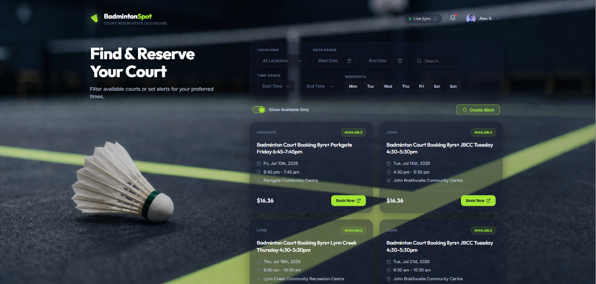

# BadmintonSpot 🏸

The Premium Real-Time Court Reservation Dashboard & Automated Alert System for North Vancouver.

---

### Tech Stack

---

## Value Proposition

NVRC badminton courts are highly competitive and book out within seconds of release. BadmintonSpot acts as a premium, automated reservation concierge. It continuously monitors the booking portal, indexes real-time vacancies, and notifies subscribed players the exact second a court opens up. 

By replacing manual refreshes with automated background tracking, it maximizes court utilization and provides players with a significant scheduling advantage.

---

## Core Features

- **High-Fidelity Visual Dashboard**: A premium, responsive single-page web app built with Vite and React, featuring a signature dark glassmorphic UI styled for modern athletics.
- **Intelligent Time & Date Range Filters**: 
  - Custom English-only date range picker to bypass native browser localization.
  - Scrollable time range picker to bound search parameters precisely by hours and minutes.
- **Multi-Location & Weekday Matching**: Simultaneously monitor and query court availability across all major recreation centres (Delbrook, JBCC, Lions Gate, Parkgate) filtered by day-of-week.
- **Verified Spam-Free Alerts**: Two-step email verification (OTP) ensures only valid, active subscribers receive court openings.
- **Secure One-Click Cancel**: Automated email alerts include individualized, cryptographically secure token links (`unsubscribe_token`) allowing users to safely cancel notifications with one tap.
- **Cross-Platform Time Synchronicity**: Custom backend timezone alignment maps database UTC records directly to the `America/Vancouver` timezone on client devices.
